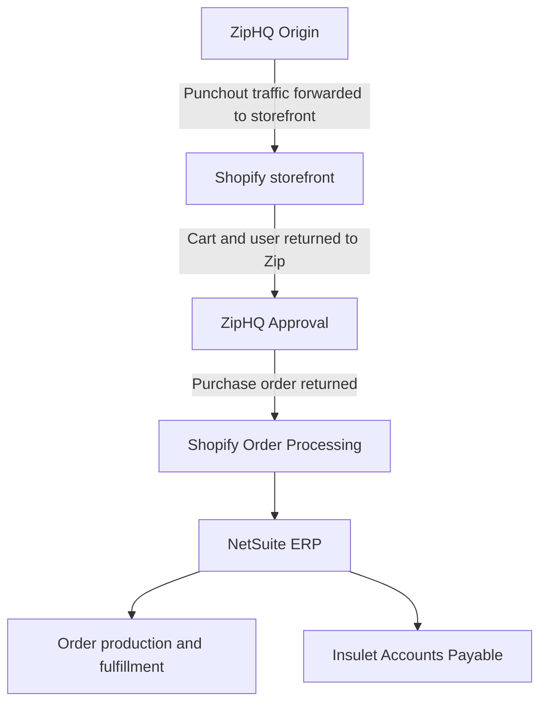

# **Insulet × Merchology PunchOut + SSO Integration**  
### **Engineering Case Study — Corporate Procurement, PunchOut cXML, Shopify, and Multi-System Orchestration**  
**By: Austin Poulson (Web Developer, Merchology)**

Site: https://insuletmerch.com/

*Last Updated: Tuesday Nov 18th 2025*

---

---

## Table of Contents
- [Non-Technical Overview](#non-technical-overview)
- [My Role in This Project](#my-role-in-this-project)
- [Summary of Contribution](#summary-of-contribution)
- [Full Technical Case Study](#full-technical-case-study)
  - [1. Executive Summary](#1-executive-summary)
  - [2. Background & Requirements](#2-background--requirements)
  - [3. Systems Architecture Overview](#3-systems-architecture-overview)
  - [4. Challenges Identified](#4-challenges-identified-during-integration)
  - [5. Technical Solutions Implemented](#5-technical-solutions-implemented)
  - [6. Results](#6-results)
  - [7. Technical Lessons Learned](#7-technical-lessons-learned)
  - [8. Gallery & Diagrams](#8-Gallery--Diagrams)

---

## **Non-Technical Overview**

Insulet needed a corporate merchandise store capable of integrating directly with their procurement platform, ZipHQ, using a PunchOut checkout flow. Employees had to be able to browse products inside ZipHQ, transfer carts to Merchology’s Shopify store, route approvals, and have their final purchase order automatically returned to Merchology for fulfillment.

The project required coordinating five major systems:

- **ZipHQ** (procurement)  
- **PunchOut Cloud** (cXML translation platform)  
- **Shopify** (storefront + data ingestion)  
- **NetSuite** (order management + invoicing)  
- **Azure AD** (Single Sign-On)

The project involved debugging misaligned data structures, resolving missing billing information, stabilizing order flows, configuring SSO, aligning invoice requirements, and ensuring all system stakeholders spoke the same technical language.

This case study describes how the technical challenges were solved, the architectural considerations, and the engineering decisions that ensured the project succeeded.

---

## **My Role in This Project**

Although the project spanned multiple systems, the core technical glue holding everything together lived in **Shopify**. My responsibilities centered around the following:

---

### **1. Shopify Engineering & Systems Integration**

- Ensuring PunchOut Cloud created valid Shopify orders  
- Managing metafields, customer mapping, and order normalization  
- Making Shopify accept cXML-based orders that bypassed checkout  
- Ensuring SSO (Azure AD → Shopify) worked seamlessly for PunchOut users  
- Handling unconventional order flows like Group Orders and shipping-bypassed transactions  

---

### **2. Multi-System Architecture & Requirements Alignment**

Even though NetSuite engineering was handled by other team members, this project required deep architectural coordination:

- Identifying which missing fields broke NetSuite invoice ingestion  
- Diagnosing issues at the cXML level (ZipHQ → PunchOut Cloud → Shopify)  
- Documenting and communicating PunchOut limitations (e.g., shipping cannot be calculated without checkout)  
- Ensuring all stakeholders—PunchOut Cloud, ZipHQ, Insulet AP, and internal Merchology engineers—shared the same understanding of requirements and constraints  

---

### **3. Debugging Complex Cross-System Failures**

Work included:

- Analyzing malformed or incomplete cXML payloads  
- Correlating Shopify order IDs, PO numbers, PunchOut session IDs, and NetSuite order records  
- Recreating failed orders for reproducible testing  
- Tracing logic failures across systems that were not originally designed to talk to each other  

---

### **4. Leading Resolution of Data Integrity Issues**

Types of issues:

- Missing billing addresses  
- Missing first/last names  
- Incorrect PO numbers  
- Missing PunchOut metafields  
- Incorrect `addressID` mapping  
- Sandbox vs production mismatches  

Fixes required pushing updates both **upstream (ZipHQ)** and **downstream (PunchOut Cloud)**.

---

## **Summary of Contribution**

I acted as the **central integrator**—the engineer who understood how each system influenced the others. I ensured that the Shopify side of the PunchOut flow was technically correct, predictable, and compatible with all downstream requirements. I also shaped the overall architecture by identifying constraints, exposing upstream data issues, and coordinating teams across all organizations involved.

---

# **Full Technical Case Study**

## **1. Executive Summary**

Insulet partnered with Merchology to launch a dedicated corporate storefront for employee merchandise purchases. A key requirement was integrating Insulet’s procurement system (ZipHQ) via PunchOut Cloud using cXML. The solution needed to support:

- Seamless PunchOut from ZipHQ into Shopify  
- Automatic approval routing and PO return via cXML  
- Accurate and complete order data for billing and NetSuite invoicing  
- Azure AD–backed SSO for end users  
- Correct tax, billing, and shipping behavior despite Shopify’s checkout being bypassed  
- A stable, production-ready workflow that AP and Procurement could rely on  

The project involved untangling several interoperability issues across Shopify, PunchOut Cloud, ZipHQ, and NetSuite, then designing solutions that preserved data integrity under PunchOut constraints while ensuring an intuitive and reliable user experience for Insulet employees.

---

## **2. Background & Requirements**

Insulet uses ZipHQ as its global procurement gateway. Employees browse products, launch a PunchOut session, build a cart externally, send it for supervisor approval, and finally send an approved PO back to Merchology for fulfillment.

The new Insulet-branded storefront required:

- PunchOut Launch → Shopify session with user identity preserved  
- Shopify Cart → cXML payload returned to ZipHQ  
- ZipHQ → PunchOut Cloud → Shopify order creation flow  
- NetSuite order ingestion, tax calculation via Avalara, and invoice creation  
- AP validation using a correct PO number  
- SSO to ensure no login friction once inside the storefront  

This introduced complexities not found in normal Shopify stores, primarily because PunchOut workflows bypass the standard checkout, short-circuiting shipping, tax, account creation, and email logic.

---

## **3. Systems Architecture Overview**

### **3.1 PunchOut Architecture**

Insulet Employee
↓ (PunchOut launch from ZipHQ)
ZipHQ (PunchOut)
↓ cXML PunchOutSetupRequest
PunchOut Cloud
↓ Shopify session + cart creation
Merchology Shopify Storefront
↓ Order Webhook → NetSuite
NetSuite ERP
↓ Invoice → Insulet AP System
Insulet Accounts Payable

markdown
Copy code

### **3.2 SSO Architecture**

Insulet Azure AD
↕ Metadata exchange (SAML)
Shopify SAML SSO App (Xecurify)
↓ Session creation
Insulet Storefront (Authenticated)

yaml
Copy code

---

## **4. Challenges Identified During Integration**

### **4.1 Missing Required Order Fields (Blocking Invoices)**

Early testing revealed that cXML orders arriving from PunchOut Cloud included:

- Missing `FirstName` / `LastName`  
- Billing address populated as placeholder values (`?`)  
- Missing PunchOut metafields  

**Result:** NetSuite refused to generate invoices.

**Root cause:** ZipHQ was sending incomplete `<BillTo>` data for certain subsidiaries, which PunchOut Cloud passed directly to Shopify.

**Fix:** Coordinated debugging across ZipHQ, PunchOut Cloud, and Merchology to ensure complete and consistent field population before Shopify order creation.

---

### **4.2 Shipping Calculation Limitations**

PunchOut bypasses the Shopify checkout entirely.

**Impact:**  
Shopify *cannot* calculate shipping because no shipping method is chosen.

Incoming PunchOut orders defaulted to a generic “Shipping” line with no cost.

**Evaluated Workarounds:**

1. Use Insulet’s FedEx/USPS account for all PunchOut orders  
2. Bill shipping separately after receiving the PO  
3. Send shipping line items back via cXML pre-approval (possible, but requires ZipHQ dev work)  

**Key architectural truth:**  
> Calculating shipping on the cart page would require rebuilding checkout logic — non-trivial in Shopify.

---

### **4.3 Invoice Testing & AP Workflow Issues**

During AP validation:

- Wrong PO number formats  
- Sandbox vs production order ID mismatches  
- Some invoices routed into the production AP queue unintentionally  
- Avalara tax calculated, but NetSuite didn’t receive corresponding tax items  

**Fix:** Built a stable, reproducible test framework and normalized mapping between ZipHQ → PunchOut Cloud → Shopify → NetSuite.

---

### **4.4 SSO Requirements for PunchOut Sessions**

PunchOut users must experience **zero login friction**.

Challenges:

- Aligning IdP-initiated vs SP-initiated flows  
- Ensuring correct Azure AD metadata exchange  
- Maintaining session continuity  
- Preventing Shopify login prompts  

**Result:** SSO needed to be fully configured before testing or launch.

---

### **4.5 Data Consolidation & Customer Mapping**

Insulet required all PunchOut orders to consolidate into a single NetSuite customer record:

233810 Insulet/ZIP HQ

yaml
Copy code

This required controlling:

- Customer creation overrides  
- Billing-address corrections  
- Proper invoice routing  

---

### **4.6 Group Order Email Confirmations**

Group Orders using “Ship to Office” workflows were not sending confirmation emails.

**Root cause:**  
Shopify suppresses notifications unless a specific flag (“Send to individuals”) is enabled.

**Fix:** Enabled correct flag and validated reliable firing of confirmation emails.

---

## **5. Technical Solutions Implemented**

### **5.1 Normalizing PunchOut Field Data**

- Validated name, email, bill-to, and ship-to fields  
- Replaced placeholder `?` billing addresses with a standard AP address  
- Ensured proper metafield population  
- Coordinated with ZipHQ to fix incomplete BillTo data  

**Impact:**  
Invoice-ready Shopify orders — no more NetSuite blocks.

---

### **5.2 Shipping Strategy & Architectural Constraints**

- Documented why Shopify cannot calculate shipping in PunchOut  
- Provided three viable options  
- Ensured all teams understood technical constraints  
- Prepared store for Insulet’s selected approach  

**Impact:**  
Unblocked go-live with a clear long-term roadmap.

---

### **5.3 SSO Integration with Azure AD**

- Exchanged SAML metadata  
- Installed and configured Xecurify SSO app  
- Validated IdP-initiated flows  
- Ensured PunchOut → SSO → Shopify session continuity  
- Eliminated Shopify login prompts  

**Impact:**  
Secure, frictionless authentication aligned with enterprise standards.

---

### **5.4 Stabilizing Invoice Workflow**

- Ensured valid PO numbers  
- Verified ingestion across Shopify → NetSuite  
- Validated AP routing  
- Confirmed Avalara tax consistency  
- Reproduced test orders for confirmation  

**Impact:**  
Reliable downstream invoice handling.

---

### **5.5 Operational Improvements**

- Consolidated orders under a unified NetSuite customer  
- Enabled group-order confirmation emails  
- Ensured correct defaults for domestic/international shipping  
- Clarified FedEx vs USPS routing rules  

**Impact:**  
Reduced confusion and improved internal + external reliability.

---

## **6. Results**

- ✓ **Full PunchOut Integration Successful** — stable, production-ready  
- ✓ **SSO Fully Configured** — seamless Azure AD login  
- ✓ **Invoice Workflow Validated** — end-to-end financial accuracy  
- ✓ **Cross-Team Alignment Achieved** — unified architecture understanding  
- ✓ **Shipping Limitations Documented** — realistic expectations for PunchOut in Shopify  

---

## **7. Technical Lessons Learned**

1. **cXML normalization is mission-critical.**  
   Minor `<BillTo>` inconsistencies can completely break downstream invoicing.

2. **Shopify checkout bypass requires architectural forethought.**  
   Checkout drives shipping, taxes, discounts, and payment logic.

3. **Field requirements across systems must be aligned early.**  
   NetSuite, AP, PunchOut Cloud, and Shopify each enforce different validation needs.

4. **SSO metadata exchange must happen early.**  
   PunchOut + SSO demands clean, reliable session transitions.

5. **Test orders must be reproducible and traceable.**  
   Prevents divergence between Sandbox, PunchOut Cloud, and production systems.

---

#$ 8. Gallery & Diagrams

### Zip eProcurement Flow

### UI Highlights

